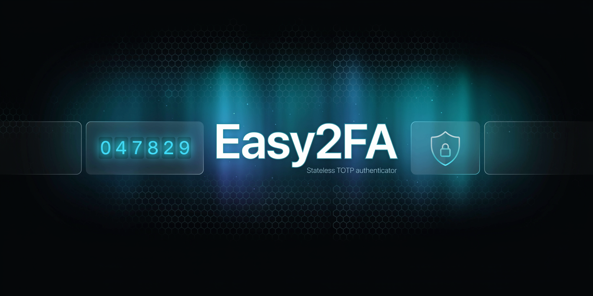
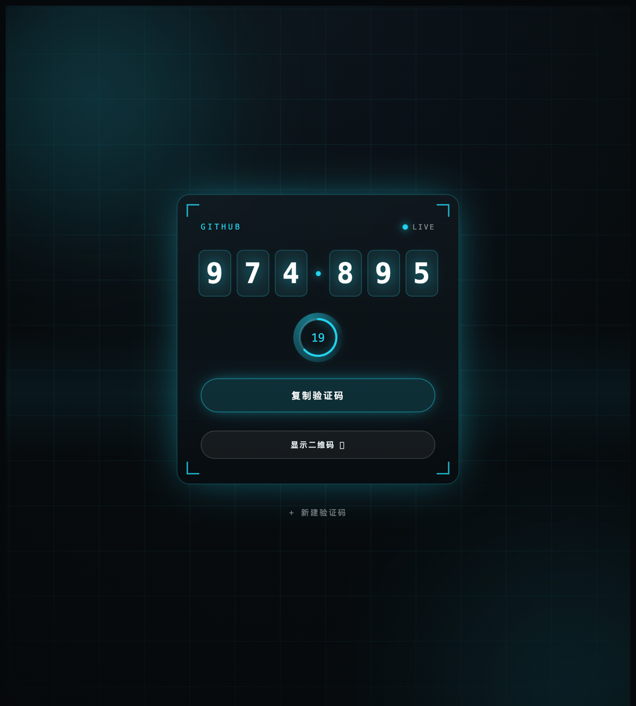
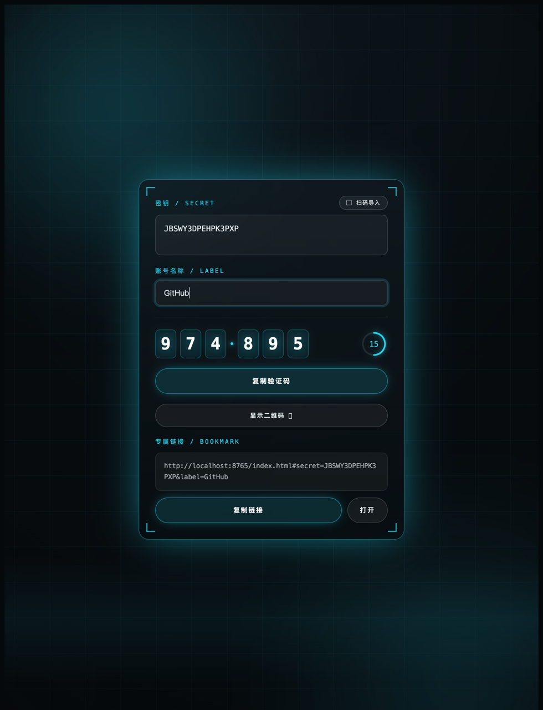
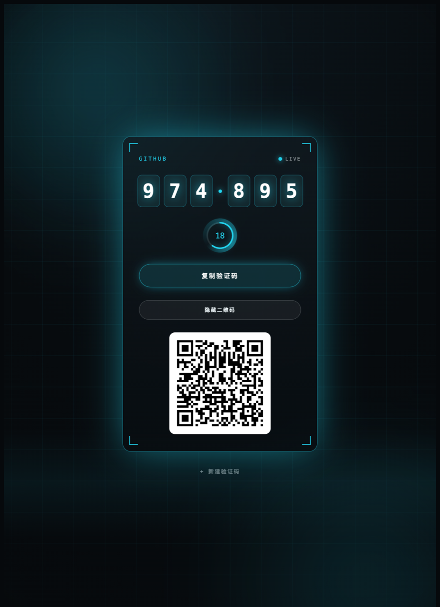

<div align="center">

# Easy2FA



### _存放密钥的工具，理应完全掌握在自己手中。_

**无状态、可自部署的 TOTP（两步验证）验证码工具——无后端、无数据库、无追踪，密钥永不离开你的浏览器。**

**⚡ 极简部署 · 🆓 永久免费 · 🧰 完全免维护**

[](https://github.com/zeropl/2FA/stargazers)
[](LICENSE)
[](#部署说明)
[](#工作原理)
[](tests.html)
[](https://github.com/zeropl/2FA/actions/workflows/tests.yml)

[English](README.md) · 简体中文

</div>

---

## 🚀 一键部署

> 纯静态、**无构建步骤**。每个按钮都会**把本仓库 clone 进你自己的 GitHub 账号再部署**——于是你得到一份自己的、免费且自动更新的副本。仓库里自带各平台配置（`wrangler.jsonc` / `netlify.toml` / `vercel.json`），部署零配置。

[](https://deploy.workers.cloudflare.com/?url=https://github.com/zeropl/2FA)
[](https://app.netlify.com/start/deploy?repository=https://github.com/zeropl/2FA)
[](https://vercel.com/new/clone?repository-url=https://github.com/zeropl/2FA)

想用 **GitHub Pages**、或想先自己 fork？见下方详细的 **[部署说明](#部署说明)**。

---

## 为什么又造一个 2FA 工具？

手里的测试号总是越攒越多——CI 机器人、staging 后台、爬虫小号、跟同事共用的演示账号——如今个个都强制开 2FA。塞进手机验证器？它们会和你的银行卡挤在同一列，换手机要整队迁移，同事要用一下还得把手机递过去。录进密码管理器？为一批随时会删的小号专门建 vault，像租银行金库存回形针。

Easy2FA 把「账号」变回「链接」：

- **一条书签 = 一个号。** 点开，验证码已经在跳。
- **发条链接 = 交接完成。** 同事打开就能读码登录，什么都不用装。
- **拖个文件 = 全员大屏。** 把你的 `.txt` 链接列表拖进页面，整屏实时验证码网格。

没有账号体系、没有 App、没有同步——于是也没有「换了设备就没了」、没有「忘了主密码」、没有「服务商跑路」。它只是一个**静态文件夹**：托管在哪里都行，今天能跑，十年后还能跑。

## 它的三个立场

2FA 工具遍地都是。Easy2FA 值得存在，是因为它把三件事做到了大多数工具懒得做的程度：

### 一、根本不存，是最好的存储

别的工具承诺「我们会安全地存储你的密钥」；Easy2FA 的回答是：**我根本不存**。没有服务器（纯静态文件），没有注册账号，浏览器里也不留数据——你的书签和链接文件才是唯一底账。

唯一的例外是多号看板，而它也只是一份「最近打开」式的本地缓存：一键清空、重拖文件即恢复，从不承担「保管」的责任。备份、加密、找回、防泄露……有状态才有的一整串麻烦，在这里整串消失。

### 二、密钥不出网，浏览器作证

「我们不上传你的数据」谁都会说；Easy2FA 让**浏览器替你验证**这句话：

- 密钥住在 URL 的 `#` 片段里——HTTP 协议本身规定，`#` 后面的内容**从不**随请求发出；
- 页面自带 **CSP（`connect-src 'self'`）**——哪怕将来某个依赖被投毒，发往外部的请求也会被浏览器当场拦下；
- React 等库全部 vendored 进仓库、不碰 CDN。打开 DevTools 的 Network 面板看：每一个请求都指向你自己的域名。

### 三、绝不自信地算错

对 2FA 工具来说，**「淡定地显示一个错码」比崩溃更恶劣**——你会拿着错码反复重试，直到把账号锁死。所以：

- 算法用 RFC 6238 官方测试向量锁死；[`tests.html`](tests.html) 的 **98 项自测直接提取生产代码执行**——测的就是线上跑的那份，测试与实现不可能漂移，且每次 push 由 CI 无头跑一遍；
- 不支持就明说：HOTP 链接**直接拒绝**（而不是按 TOTP 硬算一个错的），迁移码里未知的算法 / 位数**直接丢弃**（而不是猜个默认值）；
- 打开页面会和服务器的 `Date` 响应头**对表**：设备时钟偏差 ≥10 秒就在页面顶端警告「验证码可能无效」。时钟不准是 TOTP 最隐蔽的翻车方式，大多数工具对此保持沉默。

## 用来做什么 / 什么场景用

- 🧮 **一屏看到多个号的码。** 把一个 `.txt` / `.md` / `.yaml` 的账号链接文件拖到页面上（或粘贴，或扫 **Google Authenticator 导出二维码**）→ 整屏彩色网格，所有码一次看全。你的文件始终是底账；看板只在本地缓存，随时可清空。
- 🗂️ **管理很多测试号。** 把每个号存成一条书签（`…/#secret=…&label=acme-test`）。点一下书签 → 立刻看到该号当前的验证码。不用装验证器 App、不用维护账号列表、不用同步。一个"测试号"书签文件夹就是你的总览面板。
- 🤝 **把账号临时借给同事 / 好友用一下。** 把该账号的链接发给对方，对方打开就能读到实时验证码登录——既不用把你的密码管理器凭据给他，也不用让他装验证器。*（链接里带着密钥，请通过可信渠道发送，用完及时轮换密钥。）*
- ⚡ **临时算一次码。** 在首页粘贴密钥、读出验证码、关掉标签页。天生无状态，什么都不存。
- 📱 **把密钥导到手机。** 点"显示二维码"，生成 `otpauth://` 二维码，直接扫进 Google Authenticator / Authy / 任意验证器 App。
- 🖥️ **把码投到大屏 / 录屏。** 给任意账号链接加 `&present=1`（或点"🖥 演示模式"），切换到放大的验证码、隐藏二维码和其它控件——投屏、共享屏幕或当面给人读时，密钥二维码绝不出现在屏幕上。*（只防你这边屏幕暴露——链接本身仍含密钥，不会对收到链接的人隐藏。）*

## 功能

- 🔐 **标准 TOTP**（RFC 6238），用 Web Crypto 本地计算——支持 SHA-1/256/512、可配位数与周期
- 🔗 **每个账号就是一条链接**——`#secret=…` 在 URL hash 里，绝不发往任何服务器
- 🧮 **多号看板**——拖入链接文件（或扫 Google Authenticator 迁移码）→ 彩色网格实时显示所有码；可导回 `.txt` 列表或一条看板链接
- 📷 **二维码导入**（扫一张二维码图）& **二维码导出**（`otpauth://`，方便导到手机）
- 🖥️ **演示模式**（`&present=1`）——只显示放大的滚动验证码、隐藏二维码等会引出密钥的 UI，便于投屏 / 录屏；对它"防什么、不防什么"如实说明
- 🕰 **时钟对表**——设备时间偏差过大时明确警告，而不是让你拿着错码去撞
- 🌐 **中英双语**——右上角一键切换，自动跟随浏览器语言（`?lang=` / localStorage 可覆盖）
- 🛡 **CSP 锁网**——`connect-src 'self'`，「密钥不出网」由浏览器强制执行
- 📲 **PWA**——可添加到主屏、完全离线可用；部署新版后访客自动跟进（stale-while-revalidate）
- ♿ **可访问性**——全键盘可操作、尊重「减少动态效果」、AA 对比度
- 🚫 **无后端、无服务端存储、无埋点**——密钥永不接触服务器（看板的缓存仅在本地、可清空）
- 🪶 **小巧可移植**——纯静态文件 + 内置 React，哪里都能部署

## 截图

<p align="center">
  
  
  
</p>
<p align="center"><sub>实时验证码与倒计时 · 粘贴密钥即出码 + 生成专属书签链接 · 导出为 <code>otpauth://</code> 二维码</sub></p>

## 跟你熟悉的工具比一比

|  | 手机验证器 App | 密码管理器 | **Easy2FA** |
|---|---|---|---|
| 适合 | 个人重要账号 | 团队正式凭据 | **测试号 / 共享号 / 临时号** |
| 换台设备 | 迁移流程 / 重新扫码 | 装客户端 + 登录 | **打开书签** |
| 借同事用一下 | 把手机递过去 | 拉人进 vault | **发一条链接** |
| 数据在哪 | 手机 + 厂商云 | 服务商云端 | **你的书签 / 你的文件** |
| 能否读完全部代码 | 通常闭源 | 通常闭源 | **一个 HTML 文件** |
| 高价值账号 | ✅ 请用这类 | ✅ 请用这类 | ❌ **别用它，真的** |

这三列不是竞争关系——最后一行是认真的：银行、主邮箱、生产凭据，请交给硬件密钥或专门的验证器 App。Easy2FA 管的是它们看不上的那一大堆杂号。

## 部署说明

Easy2FA 是**纯静态**的——`index.html` + `support.js` + `vendor/`，**没有任何构建步骤**。唯一的硬性要求是 **HTTPS**（计算验证码的 Web Crypto API 需要安全上下文）；下面每个方案都自带 HTTPS（本地测试 `localhost` 也算，`file://` 不算）。

**所有平台最省心的路径都一样：先有一份属于你自己的副本，再连上它。**

> **为什么要先 fork？** fork 就是*你自己的*一份仓库拷贝。平台会盯着它，**每次 push 自动重新部署**，你可以随便改，而且全在免费额度内、零维护。上面的一键按钮其实已经替你 fork 了——每个按钮都会把本仓库 clone 进你的账号再部署那份拷贝。想自己动手 fork？先在 GitHub 点 **Fork**，再到下面任意平台用「导入 / 连接 Git」选你的 fork 即可。

仓库自带各平台配置（`wrangler.jsonc`、`netlify.toml`、`vercel.json`、`.nojekyll`），所以**没有任何构建项要填**——授权一下就能部署。

### GitHub Pages —— 免费，无需按钮

1. 把本仓库 **Fork** 到你的账号。
2. 你的 fork → **Settings** → **Pages**。
3. **Source：** 选 "Deploy from a branch" → **Branch：** `main` → **Folder：** `/ (root)` → **Save**。
4. 等约 1 分钟。站点地址为 `https://<你的用户名>.github.io/2FA/`（路径区分大小写，要和仓库名 `2FA` 一致）。

> 之所以在 `/2FA/` 子路径下也能跑，是因为应用全程用**相对路径**、Service Worker 作用域为 `./`。仓库自带一个空的 [`.nojekyll`](.nojekyll)，让 Pages 原样托管所有文件。

### Cloudflare

> Cloudflare 已于 2025 年对新项目停用 *Pages*——按钮现在创建的是一个**服务静态资源的 Worker**（结果一样：一个免费的 `*.workers.dev` HTTPS 地址）。

- **一键：** 顶部的 **Deploy to Cloudflare** 按钮（会把仓库 clone 进你的账号再部署），**或**
- **fork 后导入：** Cloudflare 控制台 → **Workers & Pages** → **Create** → **Import a repository** → 选你的 fork → 构建项全部留空 → **Deploy**。

仓库自带的 [`wrangler.jsonc`](wrangler.jsonc)（`assets.directory: "./"`）让它零配置——不用选框架、不用填构建命令、不用设输出目录。

### Netlify

- **一键：** 顶部的 **Deploy to Netlify** 按钮（clone + 部署），**或**
- **fork 后导入：** Netlify → **Add new project** → **Import an existing project** → **GitHub** → 授权 → 选你的 fork → **Build command** 和 **Publish directory** 都保持默认 → **Deploy**。

[`netlify.toml`](netlify.toml) 已固定 `publish = "."`（根目录）、无构建命令。*（按钮**或**手动 fork+导入，二选一，别两个都做，否则会有两份拷贝。）*

### Vercel

- **一键：** 顶部的 **Deploy with Vercel** 按钮（clone + 部署），**或**
- **fork 后导入：** Vercel → **Add New… → Project** → **Import Git Repository** → 选你的 fork → **Framework Preset：** `Other`，**Build** 与 **Output** 留空 → **Deploy**。

[`vercel.json`](vercel.json) 已固定 `Other` 预设（`"framework": null`）、无构建步骤、以仓库根目录为输出。

### 自己托管（任意静态服务器）

它就是一个静态文件夹，用什么托管都行，但要走 **HTTPS**：

```bash
# 本地开发（localhost 是安全上下文，验证码能正常算）
npx serve .
# 或
python3 -m http.server 8000
```

正式服务器请用 nginx / Caddy / Apache 并配 TLS 证书。纯 HTTP（非 localhost）或用 `file://` 直接打开 `index.html` **都算不出验证码**——Web Crypto 拒绝在非安全上下文运行。

> **更新已部署的版本：** 什么都不用做。你 push → 平台自动重建 → 访客的 Service Worker 会在后台自动拉取新版，下次刷新即生效。（[`sw.js`](sw.js) 里的 `CACHE` 版本号如今只在需要整体清空旧缓存池时才动。）

## 工作原理

- 6 位验证码由浏览器用 `crypto.subtle`（HMAC）本地算出——标准 RFC 6238 TOTP。
- 密钥从 `location.hash` 读取。**URL 的 `#` 片段不会进入 HTTP 请求**，所以密钥永不经网络离开你的设备——即便部署在线上，服务器看到的也只是一次静态文件请求。
- React / ReactDOM 已 **vendoring** 到 `vendor/`（不依赖 CDN → 网络差也能开，且做了完整性校验）。
- 页面自带 **CSP**（`connect-src 'self'`）——即使将来某个依赖被污染，浏览器也会拦下任何发往外部的请求，「密钥不出网」由浏览器强制执行，而不只是一句承诺。
- 加载时会用同源响应的 `Date` 头**对表**：设备时钟偏差 ≥10 秒就明确警告「验证码可能无效」——时钟不准是 TOTP 最常见的隐形翻车原因。

### 想亲自审计？一个下午就够

碰密钥的工具，值得你先读一遍代码再信任。Easy2FA 把这件事做得尽量容易：

- 全部应用逻辑在**一个 [`index.html`](index.html)** 里（约 1500 行，界面模板和中英文案都算上）；
- **没有构建步骤、没有 `node_modules`**——你在 GitHub 上读到的每一行，就是浏览器里执行的每一行；
- 整条供应链只有 `vendor/` 下四个文件：React、ReactDOM（官方 UMD 构建）和两个二维码库（生成用 qrcode.js，识别兜底用 jsQR）；
- 在你的部署上打开 `/tests.html`，**当场跑 98 项自测**——它 fetch 并测试的，正是你此刻在用的那份 `index.html`。

## 安全须知

Easy2FA 是为**测试 / 一次性账号**设计的，用一部分安全性换取便利。请了解其中取舍：

- 密钥在 **URL 里**，因此会进入你的**浏览器历史和书签**——如果浏览器开了书签/历史云同步，它也会**被同步到云端**。请把这些链接当作敏感信息。
- 你把链接发给谁，谁就拿到了密钥。请走可信渠道；临时分享后请轮换密钥。
- **重要 / 高价值账号**请改用硬件密钥或专门的验证器 App。
- 需要 **HTTPS**（Web Crypto 要求安全上下文）。本地开发用 `localhost` 可以；`file://` 不行。
- **多号看板**会把列表存进浏览器的 **localStorage**（仅本地缓存，应用本身绝不同步到任何地方）。点「清空」即可抹掉；你自己的文件才是真正的备份。
- **演示模式**（`&present=1`）只防**你这边屏幕**暴露（肩窥 / 共享屏幕 / 录屏）——靠隐藏二维码实现。它**不保护**收到链接的人：URL 里仍然带着密钥。它不是"安全分享"。

## ⭐ 如果它帮到了你

Easy2FA 没有云服务、没有 Pro 版、不收集任何数据——**star 是它唯一的营收**。如果它帮你省下过掏手机翻验证器的功夫，欢迎投喂一颗 ⭐。

[](https://star-history.com/#zeropl/2FA&Date)

## 更新记录

- **2026-07** — **看板单卡操作 + 全浏览器扫码 + CI**：看板每张卡新增 **↗ 打开单号 / 🔗 复制该号链接 / ✕ 移除**（两步确认）——不再「删一个号只能全清重导」，单号页的二维码导出也由此对每张卡可达；扫码不再依赖 Chromium 独有的 `BarcodeDetector`——vendored **jsQR** 兜底（懒加载、同源、SW 预缓存离线可用），**Safari / Firefox 也能扫**（含 GA 迁移码），原生引擎没认出来时同样落 jsQR 再试；新增 **GitHub Actions CI**：每次 push 无头跑 `tests.html` 的 98 项自测，并校验 `support.js` 的 vendor 补丁未丢（见 PATCHES.md）。
- **2026-07** — **导入真读 JSON / CSV**：文件选择器一直声称支持 `.csv` / `.json`，但解析器只会抠 URL、真拿一份 JSON / CSV 导出反而「未识别到账号」（[issue #5](https://github.com/zeropl/2FA/issues/5)）。现补齐结构化解析——JSON 支持数组 / 单对象 / 外层包一层数组，键名大小写不敏感并容忍常见别名（`name`/`account`→标签、`service`→发行方、`timer`→周期、`algo`→算法）；CSV 认 `secret` 列头、支持逗号 / 分号 / 制表符与引号内逗号，非 `secret` 表头的普通逗号文本不会被误判。补 15 项解析测试（共 98 项）。
- **2026-07** — **时钟校验 + 自动更新 + CSP**：加载时用同源 `Date` 响应头对表，设备时钟偏差 ≥10 秒明确警告「码可能无效」（消掉最后一条「自信错码」路径）；Service Worker 改 **stale-while-revalidate**，部署新版后访客自动跟进，不再依赖手动升缓存版本号；加 **CSP**（`connect-src 'self'`）把「密钥不出网」变成浏览器强制；`tests.html` 重构为**直接从 `index.html` 提取真实实现**执行（零镜像漂移），并补齐解析层测试（78 项）。同批：修复「加入看板」后刷新跳回单号的 hash 残留、iOS 主屏图标、超长看板链接提醒、密钥输入框关闭自动填充。
- **2026-06** — **界面中英双语 + 一批硬化**：右上角一键切换中/EN（按浏览器语言 / `?lang` / localStorage 自动选择）。同批：拒绝 HOTP 链接和无效/截断书签链接的"算错码"路径、可访问性（键盘复制 / 减少动态 / 焦点环 / AA 对比度）、`qrcode.js` 延迟加载，新增 `tests.html`（RFC 6238 自测）与 `PATCHES.md`。
- **2026-06** — **零配置部署**：补齐 `wrangler.jsonc` / `netlify.toml` / `vercel.json` / `.nojekyll` 和 fork 优先的部署教程，到任意平台都是"授权 → 选你的 fork → 部署"，没有构建项要填。并更正了 Cloudflare 按钮（它现在创建的是带静态资源的 Worker，不是 Pages）。
- **2026-06** — **演示模式**（`&present=1`，可选 `&nolabel=1`）：放大的验证码 + 隐藏二维码和编辑控件，便于共享屏幕而不暴露密钥二维码。如实界定边界——它防的是你的屏幕，不是链接接收方。
- **2026-06** — **多号看板**：从列表文件 / 粘贴 / 剪贴板 / Google Authenticator 迁移码导入 → 彩色网格实时显示所有码（一个定时器驱动全部）。可导回 `.txt` 列表或一条 `#board=…` 链接。看板在本地留一份可一键清空的缓存——你的文件始终是底账。
- **2026-06** — 首个版本：无状态单账号视图、粘贴密钥即出码 + 专属书签链接、二维码导入 / 导出、PWA + 离线。

## 许可

[MIT](LICENSE)
